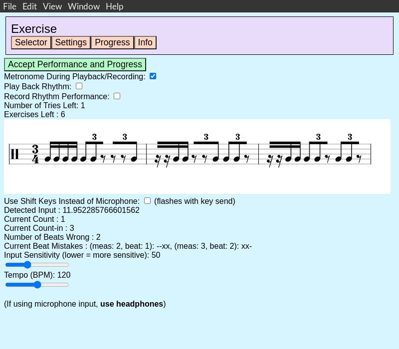
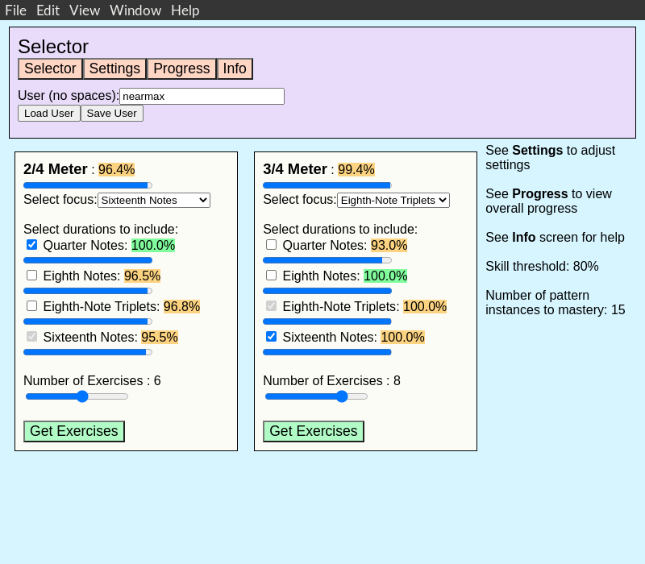
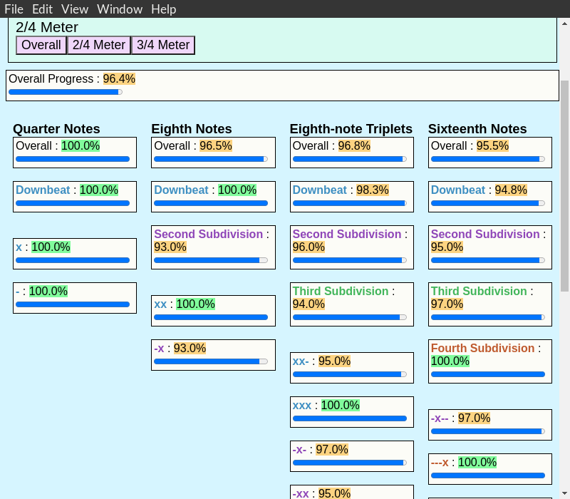

# Rhythm OLMITS
Completed as part of my graduate studies in CS, Rhythm OLMITS is a rhythm intelligent tutoring system with an open learner model to support metacognition. It is an [Electron](https://github.com/electron/electron) app using [React](https://github.com/facebook/react) for the GUI, [vexflow](https://github.com/0xfe/vexflow) for music notation, and [node-libpd](https://github.com/ircam-ismm/node-libpd) for an audio engine. It teaches how to perform rhythms from music notation, provides a hierarchical visualization of a student's progress, pinpoints learner mistakes to specific beat-centric rhythm patterns, and generates rhythm exercises according to the needs of the student.

## Supported Platforms
Supported Platforms are limited at the moment to the platforms supported by node-libpd, which are Intel Macs, Linux x64, and Raspberry Pis.

## Installation Instructions
Given an installed Node.js environment (if not installed, I suggest [nvm](https://github.com/nvm-sh/nvm)), run: `npm install` to install dependencies from the root folder and `npm run el` to run the tutoring system. I have provided builds for MacOS Intel and Linux x64 (but installation seems to be the more reliable method of getting things working).

## Known Bugs
The MacOS version tends to throw errors upon closing and the issue seems to lie with the `node-libpd` bindings as noted in [this issue thread](https://github.com/ircam-ismm/node-libpd/issues/3#issuecomment-1154899839) where the bindings throw segmentation faults.

## Other
- Software related references are in the code and also in `citations.md`- The accompanying paper can be found [here](http://hdl.handle.net/1853/67085)

